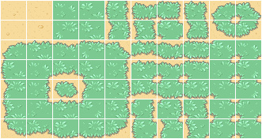
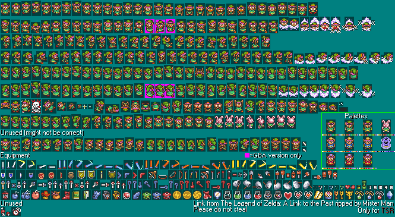
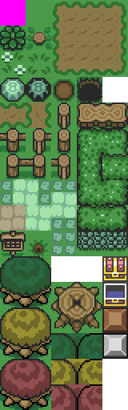

# Начало
Это дизайн документ, предназначенный для художников проекта. Здесь показаны рефференсы для создания дизайна игры.

# Как это должно выглядеть?
## >Теория
### >>Спрайты
Спрайт - это визуальная составляющая игры, т.е. определенные картинки на экране, из которых строится игра. Спрайтом называются все картинки, относящиеся к разработке игры, будь то разметка интерфейса или рисунок персонажа. Спрайт лист - это сборник спрайтов на одном листе. Спрайт листы нужны для комплектации рисунков в один файл, чаще используется для анимации.

### >>Тайлы
Тайлы - то же, что и плитки - небольшие изображения одинаковых размеров, служащие фрагментами большой картины. Количество тайлов на один «мир» может достигать нескольких сотен. То есть это отдельные клетки, за счет которых строится мир. Тайл сет же - это объединение всех нужных тайлов в одном файле. Тайлы и тайлсет можно сравнить с цветами и палитрой цветов соответственно. Пример тайлсета мира и игрока ниже.

Для самого начала можно попробовать перерисовать простенький тайлсет ниже

# Концепт карты мира игры
## >Детализированная карта

## >Сырая карта + рефференсы

## Легенда
* *Зеленым* цветом отмечен обычный равнинный биом. Локация представляет из себя просторные поля с травой, цветами, деревьями и прочей растительностью.
* *Темно-зеленым* цветом в левом верхнем углу карты отмечен лесистый биом. Локация представляет из себя темный загадочный лес, в котором обитают различные насекомые.
* *Коричневым* в правом верхнем углу отмечен горный биом. Локация представляет из себя горные склоны, которые соединены тунеллями.
* *Желтым* цветом отмечен пустынный биом. Локация должна представлять из себя жаркие полупустые просторы с множеством опасных и ядовитых противников.
* *Оранжевым* цветом в правом нижнем углу отмечен каменный биом. Локация представляет из себя прибережную каменистую местность. 

# Рефференсы биомов
## Равнины

## Лес

## Горы

## Пустыня

## Камни

## Пример с домом

# Доп. рефференсы для карты
По ссылкам ниже можно посмотреть цельную карту игры, для представления, как связывать биомы

https://www.spriters-resource.com/fullview/88873/

https://www.spriters-resource.com/fullview/146347/

Ссылка для просмотра примеров экранов в Зельде

https://tcrf.net/Development:The_Legend_of_Zelda:_A_Link_to_the_Past/Overworld
