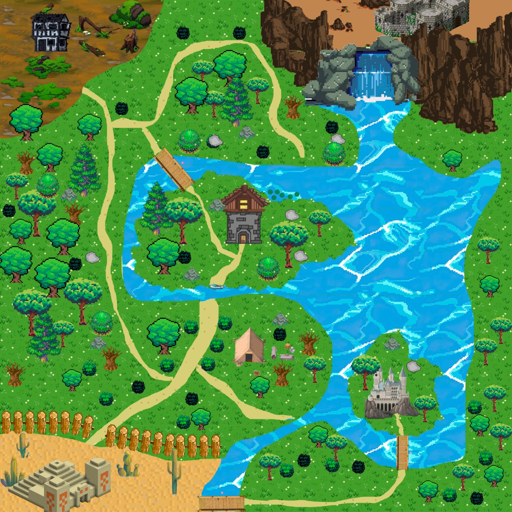
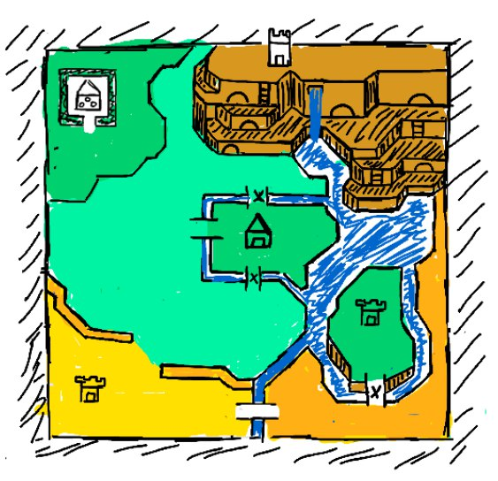
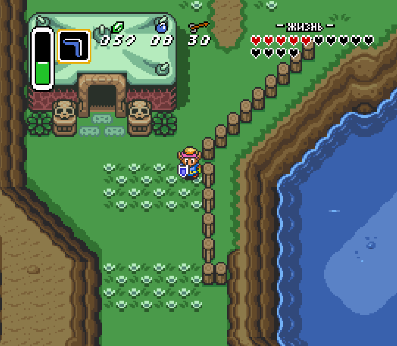
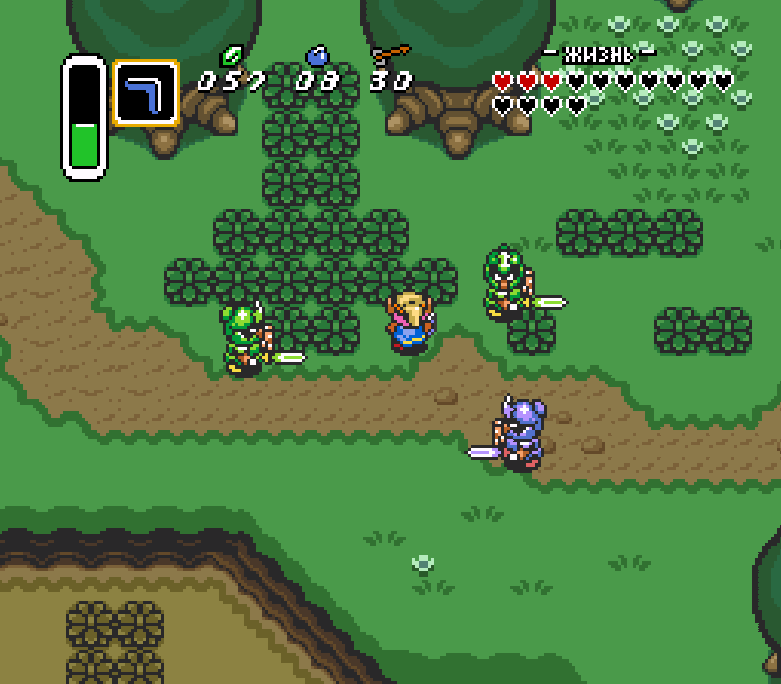
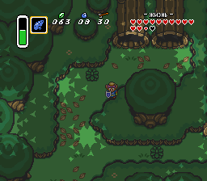
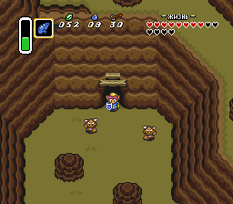
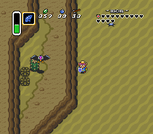
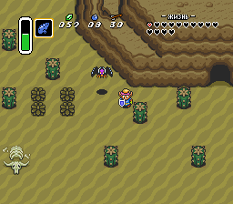
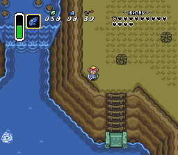
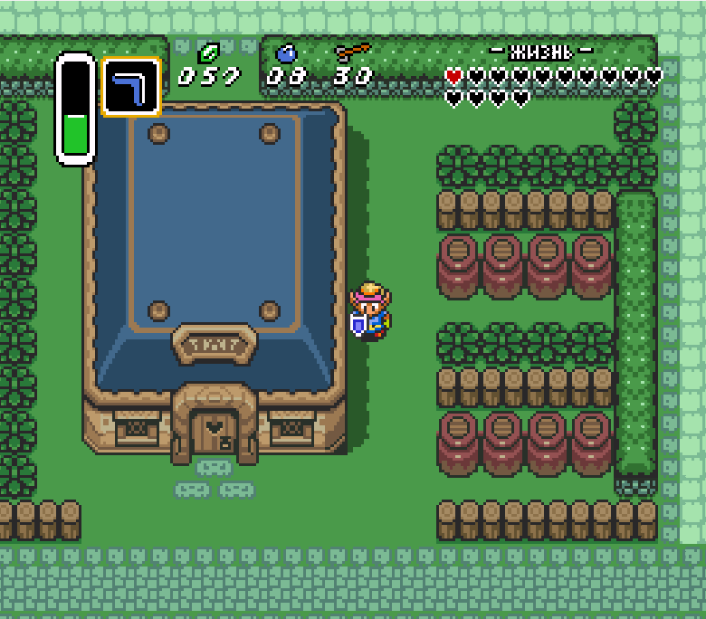

# Начало
Это дизайн документ, предназначенный для художников проекта. Здесь показаны рефференсы для создания дизайна игры.
# Концепт карты мира игры
## Детализированная карта

## Сырая карта + рефференсы

## Легенда
* *Зеленым* цветом отмечен обычный равнинный биом. Локация представляет из себя просторные поля с травой, цветами, деревьями и прочей растительностью.
* *Темно-зеленым* цветом в левом верхнем углу карты отмечен лесистый биом. Локация представляет из себя темный загадочный лес, в котором обитают различные насекомые.
* *Коричневым* в правом верхнем углу отмечен горный биом. Локация представляет из себя горные склоны, которые соединены тунеллями.
* *Желтым* цветом отмечен пустынный биом. Локация должна представлять из себя жаркие полупустые просторы с множеством опасных и ядовитых противников.
* *Оранжевым* цветом в правом нижнем углу отмечен каменный биом. Локация представляет из себя прибережную каменистую местность. 

# Дополнительные рефференсы
## Равнины

## Лес

## Горы

## Пустыня

## Камни

## Пример с домом

# Доп. рефференсы цельной карты
По ссылкам ниже можно посмотреть цельную карту игры, для представления, как связывать биомы

https://www.spriters-resource.com/fullview/88873/

https://www.spriters-resource.com/fullview/146347/
