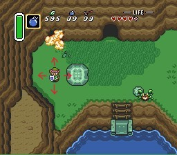

# Начало
Это дизайн документ игры, которую команда "Название Команды" делает на курсе ОПД-1
# Жанр
Жанр игры: фентези RPG с пошаговой боевой системой и головоломками.\
игры-референсы: The Legend of Zelda: A Link to the Past, Undertale.
# Синопсис
Главный герой просыпается на неизвестном ему острове. Он отыскивает храм, где отсутсвуют три волшебных камня. 
Его задача найти камни, чтобы активировать портал в храме. Для этого он посещает разные концы острова.
# Управление
Передвижение - WASD\
Взаимодействие - E\
Атака - Левая кнопка мыши\
Открыть инвентарь - I\
Выбросить предмет - R\
Выбрать предмет - двойное нажатие левой кнопки мыши
# Игровые определения
Биом - территория с уникальными игровыми правилами.\
Хаб - центральная локация, где находится храм и дом протагониста. Оттуда можно попасть в любой биом.\
Гем - волшебный камень, который необходим для активации портала в храме.\
Подземелье - лабиринтообразное подземелье, содержащее врагов.\
Система - набор глобальных правил игры, работающее всегда.\
Механика - набор правил в игре, работающее ТОЛЬКО при определённых условиях.\
NPC - неигровой персонаж.\
Враг - NPC, атаковав которого персонаж вступает в бой.\
Проджектайл - точка, линия или любой другой геометрический объект, который при встрече с другим объектом вызывает определённое событие.\
Энтити - игровая сущность.\
HP - hit points, величина которая показывает то сколько урона может выдержать персонаж или NPC перед смертью.\
ПУ - порог урона.\
СУ - сопротивление урону.
# Стиль игры
Действие игры происходит на острове с хабом посередине. Остров поделён на 3 биома, в каждом из которых находится гем.\
В процессе прохождения игроку встречаются различные Враги и головоломки, которые ему необходимо преодолеть для продвижения по сюжету.
Для победы над врагом игроку необходимо выиграть в схватке напоминающую бой из Undertale.\
Также игрок будет натыкаться на сундуки, которые содержат различные предметы: броня, оружие, зелья восстановления здоровья и т.д.\
Каждый Гем находится в подземелье, которое находится в конце одного из биомов.
# Системы и механики
## Системы
### Контроллер персонажа
Используя клавиши "Передвижение" игрок задаёт вектор. Если перед персонажем отсутствует какое-либо препятствие, игра передвигает персонажа по заданному вектору со скоростью заданой параметром "Скорость персонажа".\
Персонаж может передвигаться в четырёх направлениях. Диагональные направления исключены.\
\
Контроллер персонажа может временно отключаться когда:
* Персонаж вступает в бой
* Персонаж открывает сундук
* Персонаж открывает инвентарь
### Система здоровья
#### Враги
Враги теряют HP в битвах с персонажем. Если количеcтво HP будет меньше или равно 0, то Враг будет удалён с локации. Враги не могут восстанавливать свои HP.
#### Персонаж
Персонаж имеет определённое количество HP записанное в параметре "HP персонажа". HP персонажа могут быть регенерированы расходными предметами. Персонаж получает урон в сражениях с Врагами. Если HP персонажа будет меньше или равно 0, то игроку покажет картинку проигрыша, а дальше перенесёт в главное меню.
### Боевая система
Используя кнопку "Атака", персонаж может вступает в бой с Врагами.\
Бой представляет собой поочерёдныйх атак между игроком и Врагом. По умолчанию игрок ходит первым.
#### Ход врага
Враг во время своего хода может атаковать игрока и использовать особые навыки. Паттерн поведения определяется скриптом, который использует конкретный враг.\
Расчёт наносимого игроку урона проходит по следующему алгоритму:
1. Расчёт урона по формуле в одном из методов врага;
2. Если полученая величина больше величины ПУ у брони игрока, то переходим к следующему шагу в алгоритме. Иначе броня игрока считается не пробитой и ход врага заканчивается;
3. урон уменьшается на процент взятый из величину СУ брони иргока;
4. HP игрока уменьшается на полученую величину.
#### Ход игрока
Если игрок выбрал атаку, он должен попасть проджектайлом в энтити в мини-игре, чтобы нанести урон здоровью Врага.\
Помимо атаки игрок может использовать расходуемые предметы для восстановления здоровья. После использования расходуемого предмета игрок заканчивает свой ход.\
Если игрок выиграл в мини-игре, то происходит расчёт наносимого Врагу урона по следующему алгоритму:
1. Расчёт урона по формуле взятой из вещи оружия игрока.
2. Если полученая величина больше величины ПУ у брони Врага, то переходим к следующему шагу в алгоритме. Иначе броня Врага считается не пробитой и ход игрока заканчивается;
3. HP Врага уменьшается на полученую величину.

### Система вещей
В сундуках расположенных в мире находятся вещи. Их можно забрать оттуда использовав клавишу "Взаимодействие" рядом.\
Каждый класс вещей содержит уникальные атрибуты и наследует общие для всех вещей атрибуты от наследуемого класса "Item".
#### Оружие
Предметы этого класса экипируются игроком в слот оружия в инвентаре.
Они обладают следующими уникальными атрибутами:
* Формула расчёта урона. К этому атрибуту боевая система обращается каждый раз, когда игрок выбирает атаку;
* Урон. Величина. При использовании метода класса для её взятия, метод возвращает случайное значение в определённом диапазоне. Используется для расчёта урона;
#### Броня
Предметы этого класса экипируются игроком в слот брони в инвентаре.
Они обладают следующими атрибутами:
* ПУ. Порог урона;
* СУ. Сопротивление урону;

Оба атрибута используются при расчёте урона и описаны в боевой системе.
#### Расходуемые предметы

### Система инвентаря
При нажатиии кнопки "Открыть инвентарь", на экране появляется интерфейс с клетками. Игрок может перетаскивать предметы расположеные в клетках и взаимодействовать с ними.\
Выполнив действие "Выбрать предмет" игрок заставляет или поменять снаряжение надетое на персонажа, или использовать предмет на персонаже (пример: выпить зелье восстановления). При этом если активное снаряжение не может быть помещено в инвентарь, оно появляется в мире.\
Выполнив действие "Выбросить предмет" игра удалит из инвентаря игрока выделенный предмет и он появится в мире.

## Механики
### Получение урона
При активации атрибут персонажа "HP персонажа" уменьшается на величину, которая передаётся Врагом из его атрибутов.
### Нанесение урона
При активации атрибут Врага "HP персонажа" уменьшается на величину, которая передаётся персонажем из атрибутов его текущего оружия.
### Открытие сундука
Выполнив действие "Взаимодействие", нваходясь перед энтити сундука, игра начинает проигрывание анимации открытия сундука. После этого в инвентарь персонажа перемещается предмет, который лежал в сундуке.
# Параметры
HP персонажа - 8\
Скорость персонажа - 1
# Дизайн
БОЛЬШОЙ РАЗДЕЛ!!!
# Прогрессия
# Интерфейс
